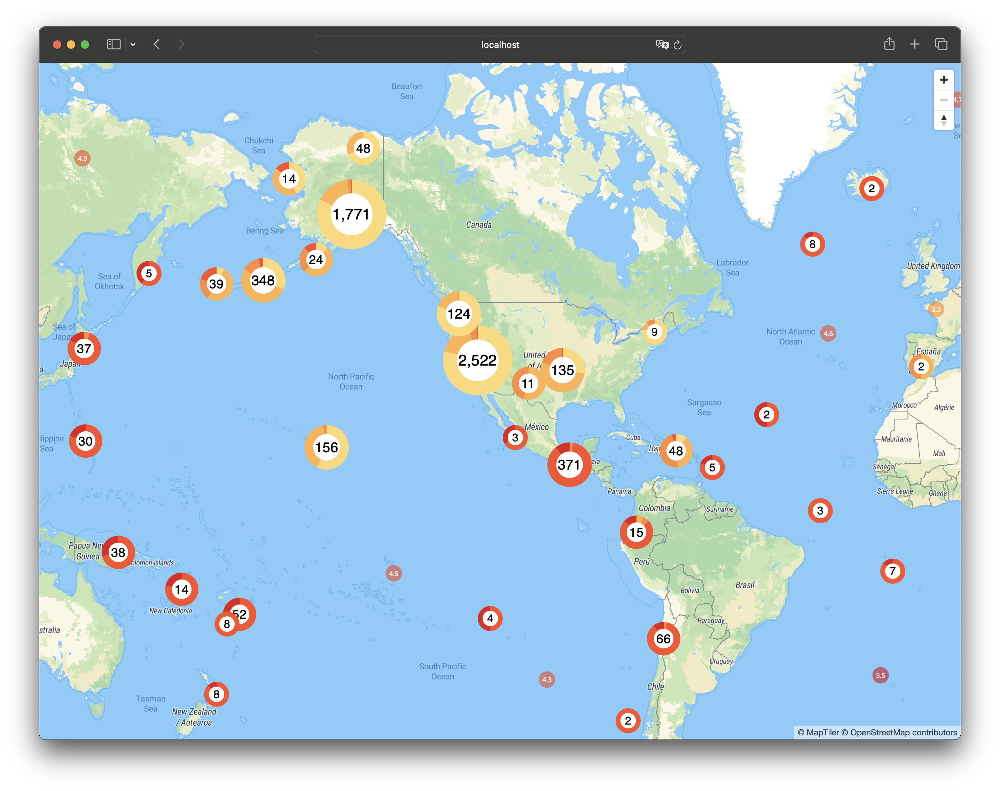

# POC Custom querySourceFeatues Renderer for react-map-gl

This is POC code of Custom querySourceFeatues Renderer implementation in react-map-gl

POC Code: [src/query-source-features.tsx](src/query-source-features.tsx)

## Start

```sh
pnpm install
pnpm dev
```

## Simple Usage

### Display React Component clusters with custom properties

Full Source Code: [src/App.tsx](src/App.tsx)

```jsx
<QuerySourceFeatures
  source="earthquakes"
  filter={["==", "cluster", true]}
  render={({ data }) => {
    <Marker
      longitude={data.geometry.coordinates[0]}
      latitude={data.geometry.coordinates[1]}
    >
      <DonutChart properties={data.properties!} />
    </Marker>
  }}
/>
```

#### preview

[](src/App.tsx)

original: https://maplibre.org/maplibre-gl-js/docs/examples/cluster-html/
